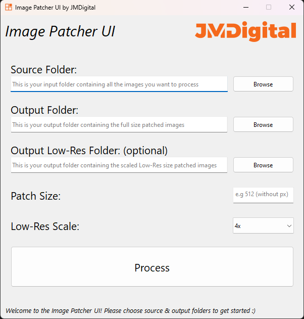

# Image Patcher UI

  

## Overview
Image Patcher UI is a versatile utility designed to aid graphic designers, game developers and Neural Network trainers in preparing their graphical assets. This program accepts a batch of high-resolution images, automatically crops them into smaller patches of a specified size, and outputs both the original patches and optional low-resolution versions to folders you specify.

## Features

- **Batch Image Processing:** Image Patcher UI can handle large batches of images at once, making it ideal for handling game textures, sprites, photography, or any graphical assets.
- **Automatic Patch Creation:** The program crops images into smaller patches based on a user-defined patch size. The process reduces larger images into manageable chunks for more optimized rendering or for creating texture atlases.
- **Optional Low-Res Generation:** Image Patcher UI can also generate low-resolution versions of each patch, useful for creating mipmap levels, LOD textures, or lower quality assets for less powerful hardware.
- **Threaded Processing:** Image Patcher UI leverages the power of multi-threading to accelerate image processing, handling multiple images concurrently.

## How to Use

1. **Source Folder:** Select your source folder containing the high-resolution images you want to patch.
2. **Output Folder:** Choose an output folder where the program will save the patched images.
3. **Low-Res Output Folder (optional):** If you need low-resolution versions, specify an output folder for them. Leave this blank if you don't need low-resolution patches.
4. **Patch Size:** Define the size of each patch. The program will slice the original images into squares of this size.
5. **Scale:** Select the scale for the low-resolution versions. This field is ignored if no Low-Res Output Folder is specified.
6. Click the **Process** button to start the process.

